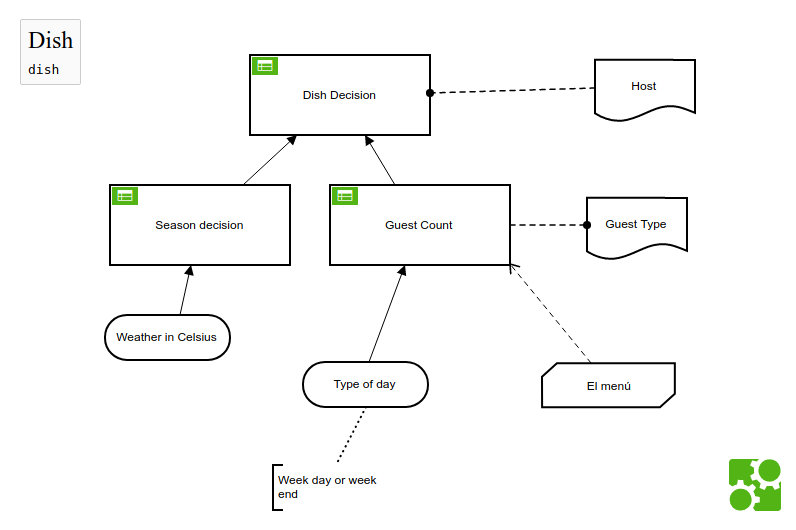

# dmn-js bundling example

This example showcases how add [dmn-js](https://github.com/bpmn-io/dmn-js)
into a node-style application and bundle it for the browser using
[webpack](https://webpack.js.org).


## About

This example uses dmn-js to embed the [dish-decision](https://demo.bpmn.io/dmn/s/check-order) diagram into a web application.




## Usage Summary

Install dmn-js via [npm](http://npmjs.org)

```
npm install --save dmn-js
```

Use it in your application

```javascript
var DmnViewer = require('dmn-js');

var dmnJS = new DmnViewer({
  container: '#canvas'
});

dmnJS.importXML(pizzaDiagram, function(err) {

  if (!err) {
    console.log('success!');

    dmnJS
      .getActiveViewer()
        .get('canvas')
          .zoom('fit-viewport');
  } else {
    console.log('something went wrong:', err);
  }
});
```

Add [babel-loader](https://github.com/babel/babel-loader) to your
[webpack config](./webpack.config.js) to transpile the ES6 source code of
dmn-js to cross-browser understandable ES5.

Ensure you got the relevant babel plug-ins needed for dmn-js installed:

```
npm i --save-dev babel-plugin-inferno babel-plugin-transform-object-rest-spread babel-plugin-transform-class-properties babel-plugin-transform-object-assign
```

Bundle the `src/app.js` file for the browser with webpack:

```
webpack
```

__Note:__ You may use another module bundler such as [browserify](http://browserify.org/),
too. Similar to the webpack setup you'd need to configure the mentioned babel plug-ins
to be used by `babelify` there, too.


## Building the Example

Initialize the project dependencies via

```
npm install
```

To create the sample distribution in the `public` folder run

```
npm run all
```


## License

MIT